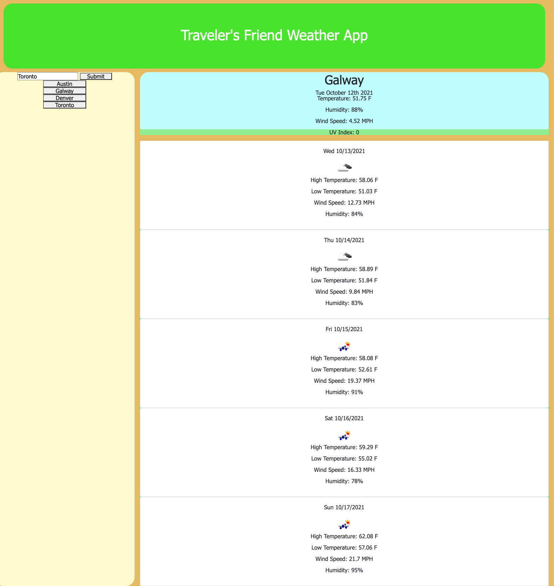

# homework-6
# Weather App

### The assignment was to create a weather app that included the current weather for a city, as well as a five day forecast. A list would be created for searched for cities with buttons that would allow you to toggle back and forth between cities. 

### I used the OneCall and the CurrentWeather APIs available from OpenWeatherMap. Data taken from the APIs and posted to the site include current temp, forecast high and low temp, humidity, wind speed, and uv index. The uv index data will be highlighted by a background that changes to indicate a low, moderate, or high uv index. 

### I have linked to JQuery, bootstrap, and moment for CSS and/or JS elements. 

### I got help from a number of people with this assignment, including my tutor Brian Ford, classmates including Jack Manzer, Ethan Cho, Mat Lundin, Phillip Welch, and a friend who is a bootcamp veteran. 

### The site is deployed at https://bmalbright.github.io/Homework-6/

